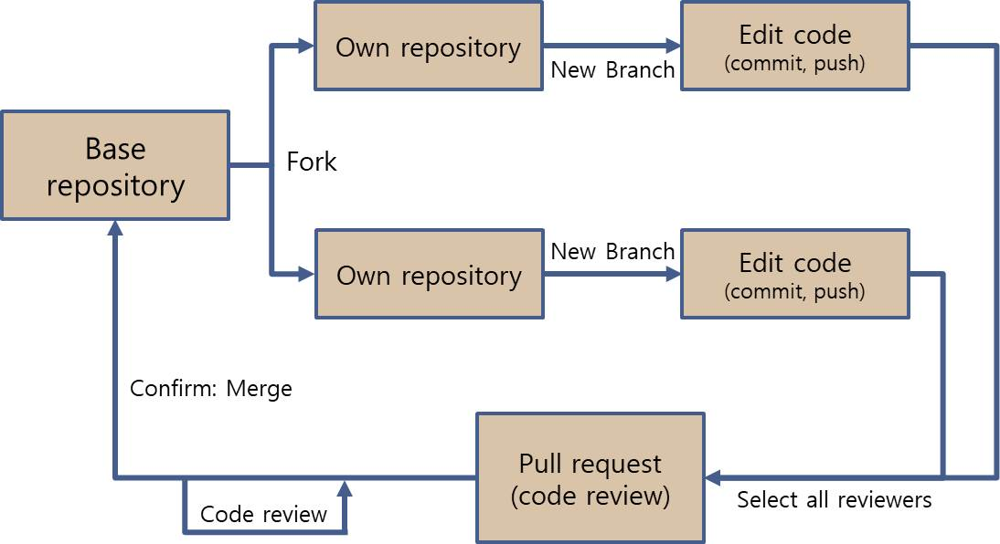

# Small Team Workflow with Git
깃을 이용한 해서 처음 프로젝트를 시작하고 많은 수행착오를 겪었다.
단순한 Branches 사용법이나 Commit, push 등 하나 하나 배워가면서 시작한 프로젝트 리포지토리는 매번 workflow가 바뀌는 것을 볼 수 있었다.   
Pull request의 사용법에 대해 고민하던 중 아 사람들은 협업을 이런식으로 하는구나! 라고 이해하고 난 뒤에 프로젝트의 workflow를 바꾸어 진행하였다.   
~~앞으로 또 바뀔 수 있겠지만 현재까지는~~

#### *글 내용 빨리 보기*
* [Pull request 를 알기 이전](Record_of_work/SmallTeamWorkflow.md:11)
* [Pull request 를 알고 난 후](Record_of_work/SmallTeamWorkflow.md:26)
* [최종 Team workflow]()

## Branch, Commit, Push 만을 이용하던 시기
처음 Branch를 보고 파일을 일일이 복사해가면서 형상관리하던 내가 정말 뒤떨어져있단것을 깨달았었다.   
[Branch 종류](https://gmlwjd9405.github.io/2018/05/11/types-of-git-branch.html)
를 보고 2~3인 정도의 소규모 협업에는 완전하게 적용하기는 힘들겠다고 판단, 간소화시켜 적용하였다.   

 
Branch name | explain
------------|---------
master      | 배포용
development | 배포 전 테스트
private     | 각자 개인의 작업공간

각자 private에서 작업하고 development로 merge하여 코드를 합치는 방법으로 진행하였다.
자동으로 형상관리를 해주는건 좋았으나 코드리뷰도 직접, 코드를 봐야하며 서로간의 아이디어, 대화도 카카오톡으로 별개로 하면서 Github는 단순히 저장공간 정도의 느낌이었다.

## Issue, Pull request 를 알고 나서

Issue를 사용하면서 차후에 개발하기 위한 아이디어를 기록하고 Issue를 기초로 한 개발을 진행하였다.
그런데 Issue를 단순히 close를 사용할때와 어찌어찌 사용한 Pull request를 사용할때의 결과가 다른것을 발견하였다.    

작업을 하면서 뭔가 Pull request와 관련되어서 merge가 되는것은 알겠는데... 아무리 Pull request에 대해서 검색해 보아도 시작점이 fork랜다
>* [git 초보를 위한 풀리퀘스트](https://wayhome25.github.io/git/2017/07/08/git-first-pull-request-story/)
>* [Pull Request 이해하기](https://velog.io/@zansol/Pull-Request-%EC%9D%B4%ED%95%B4%ED%95%98%EA%B8%B0)

Pull request는 new branch에서 작업을 하고 merge를 위한 허락을 구하는 방법이다.
그런데 왜 Pull request를 하기 위해서 fork라는 복사의 작업을 하는지 이해 할 수 없었다. 
보통 새로운 기능을 발견해도 그 기능에 대해서 연습해보거나 머리로 이해해야 실질적으로 작업할때 적용하는 버릇을 가지고 있는데..결론적으로 우리는 fork를 단순히 복사로만 생각했다.~~정확히는 깊은복사로~~   
[Git fork와 clone의 차이점](https://velog.io/@imacoolgirlyo/Git-fork%EC%99%80-clone-%EC%9D%98-%EC%B0%A8%EC%9D%B4%EC%A0%90-5sjuhwfzgp)
에 관한 내용을 읽고 나서야 모든것이 연결!
 
## Team work flow 
Github는 협업을 하기 위한 유용한 도구이다.
'협업'을 잘 하기 위해서 프로젝트에 참여하는 여러 사람들의 소통이 원활하고 그러면서도 일관성있게 프로젝트가 나아가야 한다. 
 
Github에서는 Pull request를 사용하여 이러한 방식을 구현하였다.
프로젝트의 기본이 되는 Base Repository를 생성하고 개인은 이 Repository를 Fork해 간다.
Base Repository에서 바로 작업을 해도 되지만 프로젝트의 모든 권한을 가지고 있는 contributor만 가능하며 기존에 사용하던 private브랜치처럼 개인이 작업하고 중간에 commit하는 모든 것들이 함께 기록되게 된다   

*최종적으로 진행하게 된 workflow*    
   

Fork로 Repository를 복사하고 개인 저장소(로컬)로 옮겨 작업 한 뒤 commit-push 이후 pull request를 통해 모든 reviewer와 함께 코드를 보고 코드리뷰를 진행한다. 